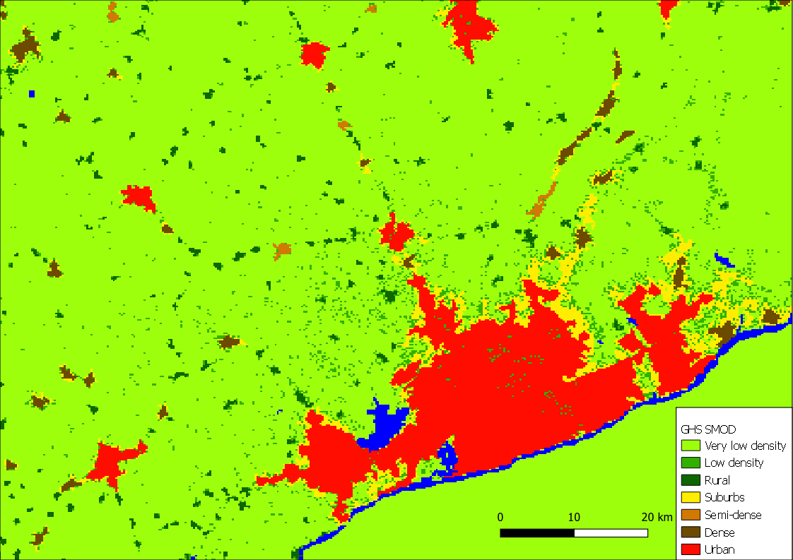

# Quantifying urbanization


Urbanization is a foundational aspect of understanding the human condition, and has been a focus of economic, social, and development study for many years. This code repository is meant to centralize many of the urban analytics performed by the World Bank's Global Operational Support Team (GOST) in support of World Bank Group operations. There are numerous code examples in the [Notebooks](https://github.com/worldbank/GOST_Urban/tree/main/Notebooks) folder including both tutorials and records of project implementations.

The [wiki](https://github.com/worldbank/GOST_Urban/wiki) is where the majority of the documentation exists, with links to specific aspects below

1. [Urban deliniation from gridded population layers](https://github.com/worldbank/GOST_Urban/wiki/Urban-delineation-from-gridded-population)
2. [Landscape Expansion Index (LEI)](https://github.com/worldbank/GOST_Urban/wiki/Landscape-Expansion-Index)

# Installation
Requires installation/download of the [gostrocks](https://github.com/bpstewar/gostrocks) library
```
pip install gostrocks
```

The notebooks should reference the appropriate functions using relative paths
